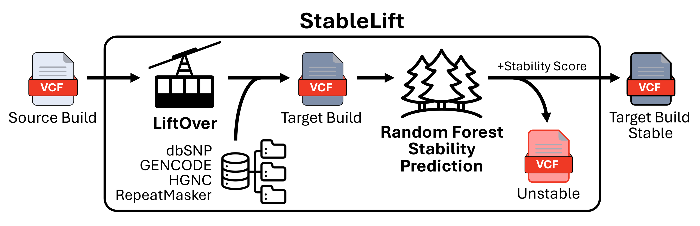

# StableLift

  - [Overview](#overview)
  - [How To Run](#how-to-run)
  - [Pipeline Steps](#pipeline-steps)
    - [1. LiftOver variant coordinates](#1-liftover-variant-coordinates)
    - [2. Variant annotation](#2-variant-annotation)
    - [3. Predict variant stability](#3-predict-variant-stability)
  - [Flow Diagram](#flow-diagram)
  - [Inputs](#inputs)
  - [Outputs](#outputs)
  - [Testing and Validation](#testing-and-validation)
    - [Test Dataset](#test-dataset)
  - [References](#references)
  - [Discussions](#discussions)
  - [Contributors](#contributors)
  - [License](#license)


## Overview

StableLift is a machine learning approach designed to predict variant stability across reference genome builds. It addresses challenges in cross-build variant comparison, supplementing LiftOver coordinate conversion with a quantitative "Stability Score" for each variant, indicating the probability of consistent representation across the two most commonly used human reference builds (GRCh37 and GRCh38). StableLift is implemented as a Nextflow pipeline, accepting either GRCh37 or GRCh38 input VCFs from six variant callers (HaplotypeCaller, MuTect2, Strelka2, SomaticSniper, MuSE2, DELLY2) spanning four variant types (germline SNPs, somatic SNVs, germline SVs, somatic SVs). Pre-trained models are provided along with performance in a whole genome validation set to define the default F1-maximizing operating point and allow for custom filtering based on pre-calibrated specificity estimates.



---

## How To Run

1. Download and extract [resource bundle](https://github.com/uclahs-cds/pipeline-StableLift/releases/download/v1.0.0/resource-bundle.zip) and [source code](https://github.com/uclahs-cds/pipeline-StableLift/releases/download/v1.0.0/source_code_with_submodules.tar.gz).
2. Download [pre-trained model](https://github.com/uclahs-cds/pipeline-StableLift/releases/tag/v1.0.0) corresponding to variant caller and conversion direction.
3. Copy [`./config/template.config`](./config/template.config) (e.g. project.config) and fill in all required parameters.
4. Copy [`./input/template.yaml`](./input/template.yaml) (e.g. project.yaml) and update with input VCF ID and path.
5. Run the pipeline using [Nextflow](https://www.nextflow.io/docs/latest/install.html#install-nextflow) `nextflow run -c project.config -params-file project.yaml main.nf`.

---

## Pipeline Steps

### 1. LiftOver variant coordinates

- For SNVs, convert variant coordinates using the `BCFtools` LiftOver plugin with UCSC chain files.
- For SVs, convert variant breakpoint coordinates using custom R script with UCSC chain files and `rtracklayer` and `GenomicRanges` R packages.

### 2. Variant annotation

- For SNVs, add dbSNP, GENCODE, and HGNC annotations using GATK's Funcotator. Add trinucleotide context and RepeatMasker intervals with `bedtools`.
- For SVs, annotate variants with population allele frequency from the gnomAD-SV v4 database.

### 3. Predict variant stability

- Predict variant stability with pre-trained random forest model and the `ranger` R package.
- Annotate VCF with Stability Score and filter unstable variants.

---

## Flow Diagram



---

## Inputs

UCLA pipelines have a hierarchical configuration structure to reduce code repetition:

* `config/default.config`: Parameters with sensible defaults that may be overridden in `project.config`.
* `config/template.config -> project.config`: Required pipeline parameters. Often shared for many inputs.
* `input/template.yaml -> project.yaml`: Required input-specific parameters.

### Input YAML

```yaml
---
sample_id: ""  # Identifying string for the input VCF
input:
  vcf: ""      # Path to the input VCF file
```

### Input Configuration

| Required Parameter                  | Type   | Description                                                                                                                                        |
| ----------------------------------- | ------ | -------------------------------------------------------------------------------------------------------------------------------------------------- |
| `output_dir`                        | path   | Path to the directory where the output files are to be saved.                                                                                      |
| `variant_caller`                    | string | Variant calling algorithm used to generate input VCF {HaplotypeCaller, Mutect2, Strelka2, SomaticSniper, Muse2, Delly2}.                           |
| `rf_model`                          | path   | Path to corresponding pre-trained random forest model.                                                                                             |
| `liftover_direction`                | string | Conversion direction {GRCh37ToGRCh38, GRCh38ToGRCh37}.                                                                                             |
| `fasta_ref_37`                      | path   | Path to the GRCh37 reference sequence (FASTA).                                                                                                     |
| `fasta_ref_38`                      | path   | Path to the GRCh38 reference sequence (FASTA).                                                                                                     |
| `chain_file`                        | path   | Path to LiftOver chain file between the source and target genome builds (included in resource-bundle.zip).                                         |
| `funcotator_data_source`            | path   | Path to [Funcotator data source](https://gatk.broadinstitute.org/hc/en-us/articles/360050815792-FuncotatorDataSourceDownloader) directory.         |
| `repeat_bed`                        | path   | Path to bundled RepeatMasker annotation file (included in resource-bundle.zip).                                                                    |
| `header_contigs`                    | path   | Path to header contigs file corresponding to target genome build (included in resource-bundle.zip).                                                |
| `gnomad_rds`                        | path   | Path to gnomAD SV data.table for annotation (included in resource-bundle.zip).                                                                     |


| Optional Parameter          | Type                                                                                      | Default                      | Description                                                                                                                                                                                                                                                                                                                                                                           |
| --------------------------- | ----------------------------------------------------------------------------------------- | ---------------------------- | ------------------------------------------------------------------------------------------------------------------------------------------------------------------------------------------------------------------------------------------------------------------------------------------------------------------------------------------------------------------------------------- |
| `target_threshold`          | numeric                                                                                   | `""`             | Target Stability Score threshold for variant filtering: [0, 1]. |
| `target_specificity`        | numeric                                                                                   | `""`             | Target specificity based on whole genome validation set for variant filtering: [0, 1]. |
| `work_dir`                  | path                                                                                      | `/scratch/$SLURM_JOB_ID`     | Path of working directory for Nextflow. When included in the sample config file, Nextflow intermediate files and logs will be saved to this directory. With `ucla_cds`, the default is `/scratch` and should only be changed for testing/development. Changing this directory to `/hot` or `/tmp` can lead to high server latency and potential disk space limitations, respectively. |
| `save_intermediate_files`   | boolean                                                                                   | false                        | If set, save output files from intermediate pipeline processes.                                                                                                                                                                                                                                                                                                                       |
| `min_cpus`                  | int                                                                                       | 1                            | Minimum number of CPUs that can be assigned to each process.                                                                                                                                                                                                                                                                                                                          |
| `max_cpus`                  | int                                                                                       | `SysHelper.getAvailCpus()`   | Maximum number of CPUs that can be assigned to each process.                                                                                                                                                                                                                                                                                                                          |
| `min_memory`                | [MemoryUnit](https://www.nextflow.io/docs/latest/script.html#implicit-classes-memoryunit) | `1.MB`                       | Minimum amount of memory that can be assigned to each process.                                                                                                                                                                                                                                                                                                                        |
| `max_memory`                | [MemoryUnit](https://www.nextflow.io/docs/latest/script.html#implicit-classes-memoryunit) | `SysHelper.getAvailMemory()` | Maximum amount of memory that can be assigned to each process.                                                                                                                                                                                                                                                                                                                        |
| `dataset_id`                | string                                                                                    | `""`                         | Dataset ID to be used as output filename prefix.                                                                                                                                                                                                                                                                                                                                         |
| `blcds_registered_dataset`  | boolean                                                                                   | false                        | Set to true when using BLCDS folder structure; use false for now.                                                                                                                                                                                                                                                                                                                     |
| `ucla_cds`                  | boolean                                                                                   | true                         | If set, overwrite default memory and CPU values by UCLA cluster-specific configs.                                                                                                                                                                                                                                                                                                     |

---

## Outputs

| Output | Description |
| ------------ | ------------------------ |
| `*_StableLift.vcf.gz` | Output VCF in target build coordinates with variant annotations and predicted Stability Scores. |
| `*_StableLift.vcf.gz.tbi` | Output VCF tabix index. |
| `*_StableLift-filtered.vcf.gz` | Filtered output VCF with predicted "Unstable" variants removed. |
| `*_StableLift-filtered.vcf.gz.tbi` | Filtered output VCF tabix index. |

---

## Testing and Validation

### Test Dataset

10 whole genomes from [The Cancer Genome Atlas (TCGA-SARC)](https://portal.gdc.cancer.gov/projects/TCGA-SARC) were used to test pipeline outputs and validate model performance. All data was processed using [standardized Nextflow pipelines](https://github.com/uclahs-cds/metapipeline-DNA). Somatic VCFs from GRCh37 and GRCh38 alignments are available for the four supported sSNV callers as [release attachments](https://github.com/uclahs-cds/pipeline-StableLift/releases).

| Donor ID       | Normal Sample ID          | Tumour Sample ID          |
|----------------|---------------------------|---------------------------|
| TCGASTSA000008 | TCGASTSA000008-N001-B01-P | TCGASTSA000008-T001-P01-P |
| TCGASTSA000014 | TCGASTSA000014-N001-B01-P | TCGASTSA000014-T001-P01-P |
| TCGASTSA000026 | TCGASTSA000026-N002-A01-P | TCGASTSA000026-T001-P01-P |
| TCGASTSA000041 | TCGASTSA000041-N001-B01-P | TCGASTSA000041-T001-P01-P |
| TCGASTSA000045 | TCGASTSA000045-N001-B01-P | TCGASTSA000045-T001-P01-P |
| TCGASTSA000060 | TCGASTSA000060-N001-B01-P | TCGASTSA000060-T001-P01-P |
| TCGASTSA000064 | TCGASTSA000064-N001-B01-P | TCGASTSA000064-T001-P01-P |
| TCGASTSA000112 | TCGASTSA000112-N001-B01-P | TCGASTSA000112-T001-P01-P |
| TCGASTSA000131 | TCGASTSA000131-N001-B01-P | TCGASTSA000131-T001-P01-P |
| TCGASTSA000200 | TCGASTSA000200-N001-B01-P | TCGASTSA000200-T001-P01-P |

---

## References

1. [StableLift: Optimized Germline and Somatic Variant Detection Across Genome Builds]()
2. [Metapipeline-DNA: A Comprehensive Germline & Somatic Genomics Nextflow Pipeline](https://www.biorxiv.org/content/10.1101/2024.09.04.611267v1)
3. [uclahs-cds/metapipeline-DNA](https://github.com/uclahs-cds/metapipeline-DNA)

---

## Discussions

- [Issue tracker](https://github.com/uclahs-cds/pipeline-StableLift/issues) to report errors and enhancement ideas.
- Discussions can take place in [pipeline-StableLift Discussions](https://github.com/uclahs-cds/pipeline-StableLift/discussions)
- [pipeline-StableLift pull requests](https://github.com/uclahs-cds/pipeline-StableLift/pulls) are also open for discussion

---

## Contributors

Please see list of [Contributors](https://github.com/uclahs-cds/pipeline-StableLift/graphs/contributors) at GitHub.

---

## License

pipeline-StableLift is licensed under the GNU General Public License version 2. See the file LICENSE for the terms of the GNU GPL license.

StableLift is a machine learning approach designed to predict variant stability across reference genome builds, supplementing LiftOver coordinate conversion to increase the portability of variant calls.

Copyright (C) 2024 University of California Los Angeles ("Boutros Lab") All rights reserved.

This program is free software; you can redistribute it and/or modify it under the terms of the GNU General Public License as published by the Free Software Foundation; either version 2 of the License, or (at your option) any later version.

This program is distributed in the hope that it will be useful, but WITHOUT ANY WARRANTY; without even the implied warranty of MERCHANTABILITY or FITNESS FOR A PARTICULAR PURPOSE. See the GNU General Public License for more details.
