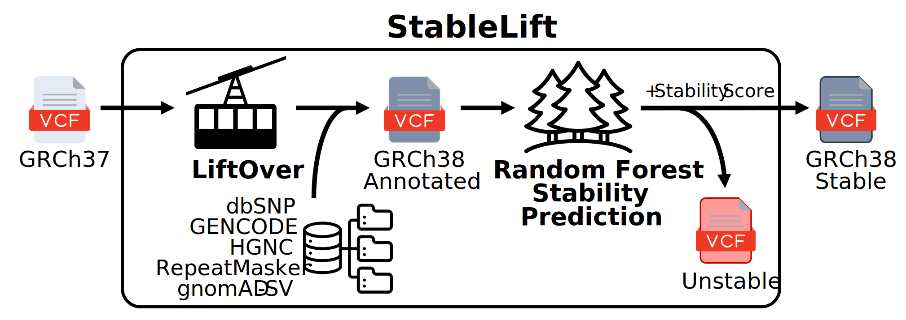

# StableLift

  - [Overview](#overview)
  - [How To Run](#how-to-run)
  - [Flow Diagram](#flow-diagram)
  - [Pipeline Steps](#pipeline-steps)
    - [1. LiftOver variant coordinates](#1-liftover-variant-coordinates)
    - [2. Variant annotation](#2-variant-annotation)
    - [3. Predict variant stability](#3-predict-variant-stability)
  - [Inputs](#inputs)
  - [Outputs](#outputs)
  - [Testing and Validation](#testing-and-validation)
    - [Test Data Set](#test-data-set)
    - [Validation <version number\>](#validation-version-number)
    - [Validation Tool](#validation-tool)
  - [References](#references)
  - [Discussions](#discussions)
  - [Contributors](#contributors)
  - [License](#license)


## Overview

StableLift is a machine learning approach designed to predict variant stability across reference genome builds. It addresses challenges in cross-build variant comparison, supplementing LiftOver coordinate conversion with a quantitative "Stability Score" for each variant, indicating the likelihood of consistent representation between the two most commonly used human reference genome builds (GRCh37 and GRCh38). StableLift is provided as a Nextflow pipeline, accepting either GRCh37 or GRCh38 input VCFs from six variant callers (HaplotypeCaller, MuTect2, Strelka2, SomaticSniper, Muse2, Delly2) spanning three variant types (germline SNPs, somatic SNVs, germline structural variants). Pre-trained models are provided along with performance in a whole genome validation set enabling threshold selection for variant filtering based on pre-calibrated sensitivity and specificity estimates.



---

## How To Run

1. Copy [`./config/template.config`](./config/template.config) (e.g. `project.config`) and fill in all required parameters.
2. For each input sample:
	1. Copy [`./input/template.yaml`](./input/template.yaml) (e.g. `sample-002.yaml`) and update with the sample ID and VCF path.
	2. Start the sample-specific pipeline run with `nextflow run -c project.config -params-file sample-002.yaml main.nf`

If you are using the UCLA Azure cluster, please use the [submission script](https://github.com/uclahs-cds/tool-submit-nf) to submit your pipeline rather than calling `nextflow` directly.

---

## Flow Diagram


---

## Pipeline Steps

### 1. LiftOver variant coordinates

- For SNVs, convert variant coordinates using the `BCFtools` LiftOver plugin with UCSC chain files.
- For SVs, convert variant breakpoint coordinates using custom R script with UCSC chain files and `rtracklayer` and `GenomicRanges` R packages.

### 2. Variant annotation

- For SNVs, add dbSNP, GENCODE, and HGNC annotations using GATK's Funcotator. Add trinucleotide context and RepeatMasker intervals with `bedtools`.
- For SVs, annotate variants with population allele frequency from the gnomAD-SV v4 database.

### 3. Predict variant stability

- Predict variant stability with pre-trained random forest model and the `ranger` R package.
- Annotate VCF with Stability Score and filter unstable variants.

---

## Inputs

UCLA pipelines have a hierarchical configuration structure to reduce code repetition:

* `config/default.config`: Parameters with sensible defaults that may be overridden in `myconfig.config`.
* `config/template.config -> myconfig.config`: Required sample-agnostic parameters. Often shared for many samples.
* `input/template.yaml -> mysample.yaml`: Required sample-specific parameters.

### Input YAML

```yaml
---
sample_id: ""  # Identifying string for the input sample
input:
  vcf: ""      # Path to the sample's VCF file
```

### Input Configuration

| Required Parameter                  | Type   | Description                                                                                                                     |
| ----------------------------------- | ------ | ------------------------------------------------------------------------------------------------------------------------------- |
| `output_dir`                        | path   | Path to the directory where the output files are to be saved.                                                                   |
| `variant_caller`                    | string | Variant calling algorithm used to generate input VCF (HaplotypeCaller, Mutect2, Strelka2, SomaticSniper, Muse2, Delly2).        |
| `rf_model`                          | path   | Path to corresponding pre-trained random forest model.                                                                          |
| `funcotator_data.data_source`       | path   | Path to Funcotator data source directory.                                                                                       |
| `funcotator_data.src_reference_id`  | string | Reference genome build ID for input VCF (hg19, hg38).                                                                           |
| `funcotator_data.dest_reference_id` | string | Reference genome build ID for output VCF (hg19, hg38).                                                                          |
| `src_fasta_ref`                     | path   | Path to the source reference sequence in FASTA format. Must correspond with `functotator_data.src_reference_id`.                |
| `dest_fasta_ref`                    | path   | Path to the destination reference sequence in FASTA format. Must correspond with `functotator_data.dest_reference_id`.          |
| `chain_file`                        | path   | Path to LiftOver chain file between the source and destination sequences.                                                       |
| `repeat_bed`                        | path   | Path to bundled RepeatMasker annotation file.                                                                                   |


| Optional Parameter          | Type                                                                                      | Default                      | Description                                                                                                                                                                                                                                                                                                                                                                           |
| --------------------------- | ----------------------------------------------------------------------------------------- | ---------------------------- | ------------------------------------------------------------------------------------------------------------------------------------------------------------------------------------------------------------------------------------------------------------------------------------------------------------------------------------------------------------------------------------- |
| `target_threshold`          | numeric                                                                                   | `""`             | Target Stability Score threshold for variant filtering: [0, 1] |
| `target_specificity`          | numeric                                                                                   | `""`             | Target specificity based on whole genome validation set for variant filtering: [0, 1] |
| `work_dir`                  | path                                                                                      | `/scratch/$SLURM_JOB_ID`     | Path of working directory for Nextflow. When included in the sample config file, Nextflow intermediate files and logs will be saved to this directory. With `ucla_cds`, the default is `/scratch` and should only be changed for testing/development. Changing this directory to `/hot` or `/tmp` can lead to high server latency and potential disk space limitations, respectively. |
| `save_intermediate_files`   | boolean                                                                                   | false                        | If set, save output files from intermediate pipeline processes.                                                                                                                                                                                                                                                                                                                       |
| `min_cpus`                  | int                                                                                       | 1                            | Minimum number of CPUs that can be assigned to each process.                                                                                                                                                                                                                                                                                                                          |
| `max_cpus`                  | int                                                                                       | `SysHelper.getAvailCpus()`   | Maximum number of CPUs that can be assigned to each process.                                                                                                                                                                                                                                                                                                                          |
| `min_memory`                | [MemoryUnit](https://www.nextflow.io/docs/latest/script.html#implicit-classes-memoryunit) | `1.MB`                       | Minimum amount of memory that can be assigned to each process.                                                                                                                                                                                                                                                                                                                        |
| `max_memory`                | [MemoryUnit](https://www.nextflow.io/docs/latest/script.html#implicit-classes-memoryunit) | `SysHelper.getAvailMemory()` | Maximum amount of memory that can be assigned to each process.                                                                                                                                                                                                                                                                                                                        |
| `dataset_id`                | string                                                                                    | `""`                         | Dataset ID to be used as output filename prefix                                                                                                                                                                                                                                                                                                                                         |
| `blcds_registered_dataset`  | boolean                                                                                   | false                        | Set to true when using BLCDS folder structure; use false for now.                                                                                                                                                                                                                                                                                                                     |
| `ucla_cds`                  | boolean                                                                                   | true                         | If set, overwrite default memory and CPU values by UCLA cluster-specific configs.                                                                                                                                                                                                                                                                                                     |
| `src_fasta_fai`             | path                                                                                      | Relative to `src_fasta_ref`  | Index for source reference sequence.                                                                                                                                                                                                                                                                                                                                                  |
| `src_fasta_dict`            | path                                                                                      | Relative to `src_fasta_ref`  | Dictionary for source reference sequence.                                                                                                                                                                                                                                                                                                                                             |
| `dest_fasta_fai`            | path                                                                                      | Relative to `dest_fasta_ref` | Index for destination reference sequence.                                                                                                                                                                                                                                                                                                                                             |
| `dest_fasta_dict`           | path                                                                                      | Relative to `src_fasta_ref`  | Dictionary for destination reference sequence.                                                                                                                                                                                                                                                                                                                                        |
| `docker_container_registry` | string                                                                                    | `ghcr.io/uclahs-cds`         | Container registry for the docker images in the following table.                                                                                                                                                                                                                                                                                                                      |

The docker images in the following table are generally defined like `docker_image_pipeval = "${-> params.docker_container_registry}/pipeval:${params.pipeval_version}"`. As such, there are three ways to modify each image:

* Change `params.docker_container_registry`. This will affect all of the images (except for GATK).
* Change `params.<tool>_version`. This will pull a different version of the same image from the registry.
* Change `params.docker_image_<tool>`. This will explicitly set the image to use, ignoring `docker_container_registry` and `<tool>_version`, and thus requires that the docker tag be explicitly set (e.g. `broadinstitute/gatk:4.4.0.0`).

| Tool Parameter           | Version Parameter    | Default                                                      | Notes                                                               |
| ------------------------ | -------------------- | ------------------------------------------------------------ | ------------------------------------------------------------------- |
| `docker_image_bcftools`  | `bcftools_version`   | `ghcr.io/uclahs-cds/bcftools-score:1.20_score-1.20-20240505` | This image must have both BCFtools and the score plugins available. |
| `docker_image_bedtools`  | `bedtools_version`   | `ghcr.io/uclahs-cds/bedtools:2.31.0`                         |                                                                     |
| `docker_image_gatk`      | `gatk_version`       | `broadinstitute/gatk:4.4.0.0`                                |                                                                     |
| `docker_image_pipeval`   | `pipeval_version`    | `ghcr.io/uclahs-cds/pipeval:5.0.0-rc.3`                      |                                                                     |
| `docker_image_samtools`  | `samtools_version`   | `ghcr.io/uclahs-cds/samtools:1.20`                           |                                                                     |
| `doker_image_stablelift` | `stablelift_version` | `ghcr.io/uclahs-cds/stablelift:FIXME`                        | This image is built and maintained via this repository.             |

---

## Outputs

| Output | Description |
| ------------ | ------------------------ |
| `*_stability.vcf.gz` | Output VCF in target build coordinates with variant annotations and predicted Stability Scores |
| `*_stability.vcf.gz.tbi` | Output VCF tabix index |
| `*_filtered.vcf.gz` | Filtered output VCF with predicted unstable variants removed |
| `*_filtered.vcf.gz.tbi` | Filtered output VCF tabix index |

---

## Testing and Validation

### Test Data Set

A 2-3 sentence description of the test data set(s) used to validate and test this pipeline. If possible, include references and links for how to access and use the test dataset

### Validation <version number\>

| Input/Output | Description | Result |
| ------------ | ------------------------ | ------------------------ |
| metric 1 | 1 - 2 sentence description of the metric | quantifiable result |
| metric 2 | 1 - 2 sentence description of the metric | quantifiable result |
| metric n | 1 - 2 sentence description of the metric | quantifiable result |

- [Reference/External Link/Path 1 to any files/plots or other validation results](<link>)
- [Reference/External Link/Path 2 to any files/plots or other validation results](<link>)
- [Reference/External Link/Path n to any files/plots or other validation results](<link>)

### Validation Tool

Included is a template for validating your input files. For more information on the tool check out: https://github.com/uclahs-cds/package-PipeVal

---

## References

1. [Reference 1](<links-to-papers/external-code/documentation/metadata/other-repos/or-anything-else>)
2. [Reference 2](<links-to-papers/external-code/documentation/metadata/other-repos/or-anything-else>)
3. [Reference n](<links-to-papers/external-code/documentation/metadata/other-repos/or-anything-else>)

---

## Discussions

- [Issue tracker](https://github.com/uclahs-cds/pipeline-StableLift/issues) to report errors and enhancement ideas.
- Discussions can take place in [pipeline-StableLift Discussions](https://github.com/uclahs-cds/pipeline-StableLift/discussions)
- [pipeline-StableLift pull requests](https://github.com/uclahs-cds/pipeline-StableLift/pulls) are also open for discussion

---

## Contributors

Please see list of [Contributors](https://github.com/uclahs-cds/pipeline-StableLift/graphs/contributors) at GitHub.

---

## License

pipeline-StableLift is licensed under the GNU General Public License version 2. See the file LICENSE for the terms of the GNU GPL license.

StableLift is a machine learning approach designed to predict variant stability across reference genome builds, supplementing LiftOver coordinate conversion to increase the portability of variant calls.

Copyright (C) 2024 University of California Los Angeles ("Boutros Lab") All rights reserved.

This program is free software; you can redistribute it and/or modify it under the terms of the GNU General Public License as published by the Free Software Foundation; either version 2 of the License, or (at your option) any later version.

This program is distributed in the hope that it will be useful, but WITHOUT ANY WARRANTY; without even the implied warranty of MERCHANTABILITY or FITNESS FOR A PARTICULAR PURPOSE. See the GNU General Public License for more details.
